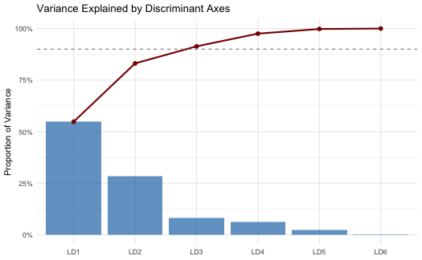
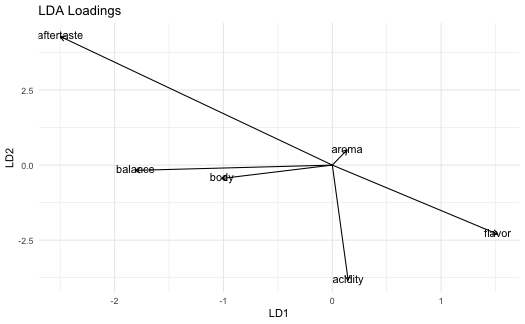
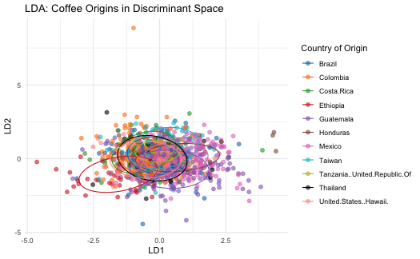
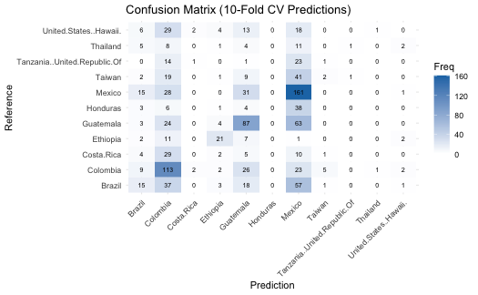
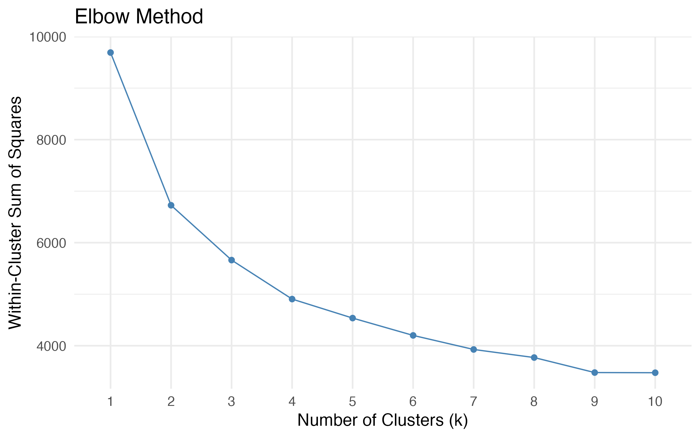
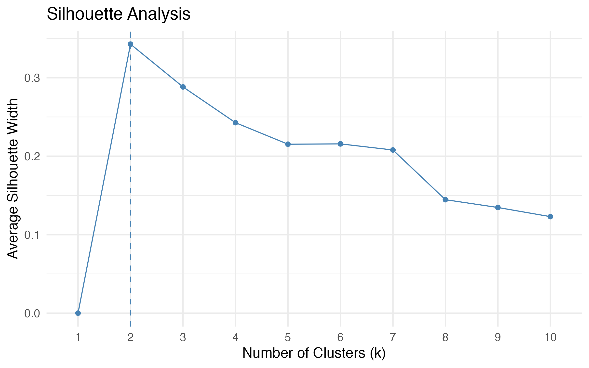
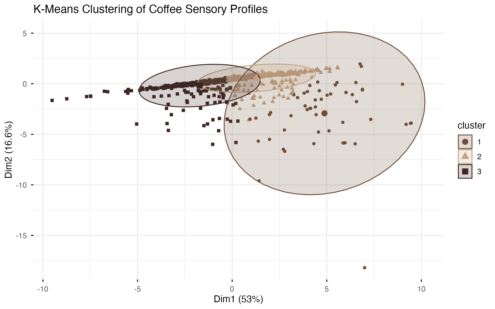
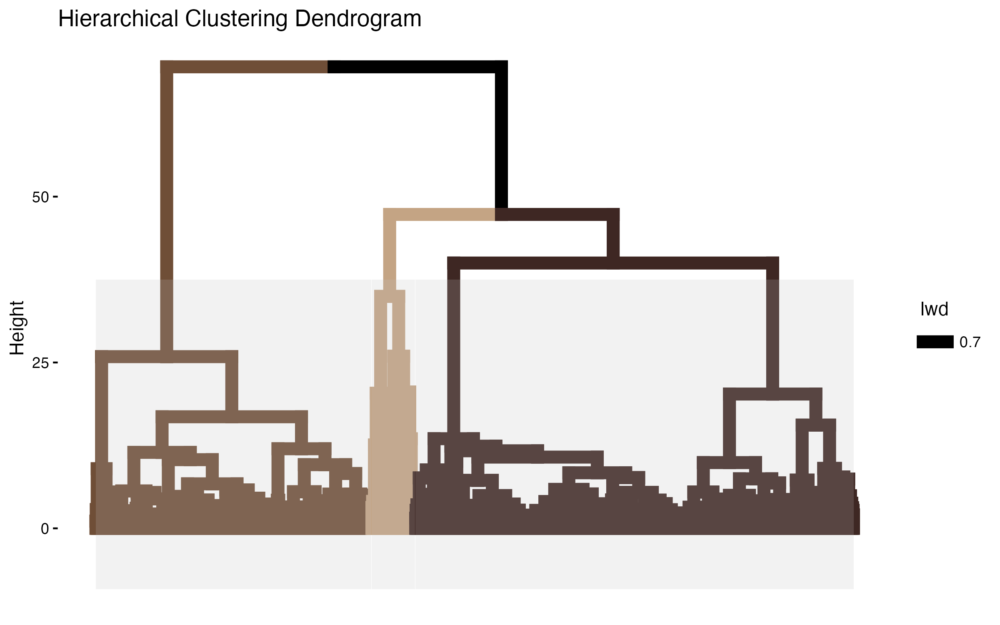

# Introduction

## Motivation

- Specialty coffee is graded by certified Q-graders on several sensory
  attributes: **aroma, flavor, aftertaste, acidity, body, balance**.
- These attribute scores are highly correlated, raising a multivariate
  question: how many **distinct dimensions of quality** are there?

## Research Questions

| | Question | Methods |
|---|----------|---------|
| **RQ1** | What latent dimensions underlie cupping scores? | PCA, factor analysis |
| **RQ2** | Do origins differ; can origin be predicted? | MANOVA, LDA |
| **RQ3** | Do clusters match known categories? | cluster analysis |

# Data

## The Data

- **Source:** Coffee Quality Institute (CQI); *Coffee Quality Database* mirror.
- **Scope:** ~1,300 Arabica samples — sensory scores plus metadata (country,
  region, variety, processing method, altitude).

## Data Cleaning

- Kept **11 countries** with at least 30 samples.
- Dropped **uniformity, clean cup, sweetness** — near-constant at 10 (almost no
  variance).
- Set implausible altitude values to missing; removed one corrupt record and rows with missing sensory scores.

Final sample: **1,099 coffees across 11 origins**.

# Exploratory Analysis

## Sample Sizes and Scores

:::: {.columns}
::: {.column width="50%"}
{width="100%"}
:::
::: {.column width="50%"}
{width="100%"}
:::
::::

- Sample sizes are imbalanced (Mexico 236, Thailand 32).
- Total Cup Points are centered around 82, with most coffees between 80–85 and a small left tail of lower-scoring samples.

## Correlation Structure

:::: {.columns}
::: {.column width="55%"}
{width="100%"}
:::
::: {.column width="45%"}
- All six attributes are positively correlated (r between 0.54 and 0.85).
- A coffee scoring well on one attribute tends to score well on the others.
- This shared variation motivates **principal component analysis**.
:::
::::

# RQ1: Principal Component Analysis

## Variance Explained: One Dominant Quality Dimension

PCA was applied to the six standardized sensory attributes; the first
principal component captures most of the shared variation among the scores.

[Sampling adequacy was high — KMO = 0.906; Bartlett's test *p* < 0.001.]{style="font-size:0.68em; color:#5f5f5f;"}

:::: {.columns}
::: {.column width="44%"}
| PC | $\lambda$ | % Var | Cum % |
|:--|:--:|:--:|:--:|
| PC1 | 4.36 | **72.6** | 72.6 |
| PC2 | 0.49 | 8.1 | 80.8 |
| PC3 | 0.39 | 6.6 | 87.3 |
| PC4 | 0.36 | 6.1 | 93.4 |

 

- PC1 explains about **73%** of the total variation.
- Only PC1 exceeds the Kaiser threshold ($\lambda > 1$).
- The six attributes mainly reflect **one common quality dimension**.
:::
::: {.column width="56%"}
{width="100%"}
:::
::::

## PCA Biplot

:::: {.columns}
::: {.column width="58%"}
{width="100%"}
:::
::: {.column width="42%"}
- - **PC1 represents overall sensory quality:** all six attributes load positively, and coffees with higher PC1 scores tend to have higher Total Cup Points.
- - **PC2 captures a weaker secondary contrast:** body and balance point in one direction, while aroma and flavor point in the opposite direction.
:::
::::

## Component Loadings

| Attribute | PC1 | PC2 |
|-----------|-----|-----|
| aroma | 0.81 | $-0.44$ |
| flavor | 0.92 | $-0.15$ |
| aftertaste | 0.91 | $-0.04$ |
| acidity | 0.82 | $-0.03$ |
| body | 0.80 | $+0.47$ |
| balance | 0.85 | $+0.22$ |

**Interpretation:** The six sensory attributes mostly move together. PC1 captures overall quality, while PC2 reflects a smaller body/balance vs. aroma/flavor contrast.

## Factor Analysis

- **One factor:** captures a general coffee quality dimension, consistent with PCA.

- **Two factors with varimax rotation:** reveal a weaker secondary structure:
  - **Flavor/aroma:** flavor, aftertaste, aroma
  - **Body/structure:** balance, body, acidity

- Factor analysis supports the PCA finding that coffee sensory scores are nearly one-dimensional.

# RQ2: Origin differences

## Is there a difference in coffee across different regions?

**Goal**

- Determine if coffee differs across the world
- Can we predict where a coffee comes from based on its scoring for different categories?
- Application: Coffee companies can decide whether region makes a difference in coffee taste

**Methods**

- MANOVA
- LDA
- 10-fold Cross Validation

**Data**

- Six standardized sensory attributes: aroma, flavor, aftertaste, acidity, body, balance
- 11 different countries of origin

## MANOVA
- Tests whether there is any difference in the mean vectors for the 6 standardized attributes between the different countries of origin
- $H_0$: $\mu_1$ = $\mu_2$ = ... = $\mu_{11}$

| Test Statistic         | Value  | Approx F | Num df | Den df | p-value |
|------------------------|--------|----------|--------|--------|---------|
| Pillai's Trace         | 0.522  | 10.375   | 60     | 6528.0 | < .001  |
| Wilks' Lambda          | 0.560  | 11.078   | 60     | 5679.2 | < .001  |
| Hotelling-Lawley Trace | 0.649  | 11.688   | 60     | 6488.0 | < .001  |
| Roy's Largest Root     | 0.356  | 38.694   | 10     | 1088.0 | < .001  |

- There is statistically significant evidence that the groups differ based on country of origin
- Pillai's Trace is the most appropriate test statistic for our analysis, due to its robustness and ability to handle non-homogenous covariance matrices

## MANOVA (continued)

| Response | F value | p-value |
|----------|---------|---------|
| Aroma | 12.724 | < 2.2e-16 |
| Flavor | 19.76 | < 2.2e-16 |
| Aftertaste | 29.729 | < 2.2e-16 |
| Acidity | 23.473 | < 2.2e-16 |
| Body | 22.748 | < 2.2e-16 |
| Balance | 31.856 | < 2.2e-16 |

- country of origin differentiates each factor at a statistically significant level
- Balance and Aftertaste have the highest F values, indicating country of origin causes large differences in these features
- even after performing Bonferonni correction, we see that every features is significantly significant
  - Bonferonni correction: 0.05/6 = 0.0083

## Linear Discriminant Analysis
- We observe that there is evidence for coffee difference between countries
- We use LDA to understand how separable the groups are based on country of origin

:::: {.columns}
::: {.column width="50%"}
{width="100%" height="100%"}
:::
::: {.column width="50%"}
{width="100%"}
:::
::::

- LD1 explains ~53% of variance, LD2 explains ~27% of variance 

## Linear Discriminant Analysis (continued)

{width="100%"}

## 10-fold Cross Validation
- Utilize cross validation to determine accuracy of LDA, with holdout over the entire dataset
- See large imbalance n classes leads to varied predictive accuracy per country

:::: {.columns}
::: {.column width="25%"}
| Metric | Value |
|--------|-------|
| AUC | 0.712 |
| prAUC | 0.218 |
| Balanced Accuracy | 0.572 |
| Mean Sensitivity | 0.215 |
| Mean Specificity | 0.930 |
| F1 | 0.347 |
:::

::: {.column width="73%"}
{width="100%"}
:::
::::

[Removed null values when calculating F1 score ]{style="font-size:0.68em; color:#5f5f5f;"}

# RQ3: Cluster Analysis

## Do coffees naturally form groups?

Goal:
- Determine whether coffees form natural sensory clusters.
- Compare clusters to known categories such as country of origin.

Methods:
- K-means clustering
- Hierarchical clustering
- Adjusted Rand Index (ARI)

Data:
- Six standardized sensory attributes:
  - aroma
  - flavor
  - aftertaste
  - acidity
  - body
  - balance
  

## Choosing the Number of Clusters

:::: {.columns}
::: {.column width="50%"}
{width="100%"}
:::

::: {.column width="50%"}
{width="100%"}
:::
::::

- The elbow plot suggested approximately 2–3 clusters.
- The silhouette score was highest at k = 2.
- We retained k = 3 to allow more detailed subgroup interpretation.

## K-Means Cluster Visualization

:::: {.columns}
::: {.column width="60%"}
{width="100%"}
:::

::: {.column width="40%"}
- Clusters showed moderate separation in the reduced PCA space.
- Some overlap existed between groups, suggesting that coffee sensory profiles vary continuously rather than forming completely distinct categories.
- The first two dimensions explained about 69% of total variation.
:::
::::

## Hierarchical Clustering and Cluster Agreement

:::: {.columns}
::: {.column width="55%"}
{width="100%"}
:::

::: {.column width="45%"}

### Adjusted Rand Index

| Comparison | ARI |
|---|---:|
| Clusters vs Country | 0.046 |

- The dendrogram supported the presence of multiple sensory groupings.
- However, agreement between clusters and country labels was weak.
- Coffees from different origins often shared similar sensory profiles.

:::
::::

# Conclusions

## Conclusions

- The sensory data is well-suited to dimension reduction (KMO = 0.906;
  Bartlett $p < 0.001$).
- Coffee sensory quality is **essentially one-dimensional**: PC1 captures ~73%
  of the variation, with all six attributes loading strongly and positively.
- A minor secondary axis (~8%) reflects **style** (aromatic vs full-bodied),
  not overall quality.

## R2 Conclustions
- There appear to be statistically significant differences in sensory coffee profiles across different countries of origin
- LDA is able to explain some separability between groups
  - Simply using LD1 and LD2 may not be good enough due to similarity between many groups
- Decent results for LDA after performing cross validation
  - Large disparity in samples by country significantly affects the predictive ability of LDA

# RQ3 Conclusions

- Coffee sensory profiles showed evidence of natural groupings.
- Approximately 2–3 clusters appeared reasonable.
- Clusters were only weakly associated with country of origin.
- This suggests that flavor characteristics overlap substantially across regions.
- Sensory quality may vary more continuously than discrete geographic categories imply.

## Limitations

- Imbalanced sample sizes across countries.
- Selection bias: CQI-submitted coffees skew high quality (scores cluster
  80–85).
- Halo effect: a grader's overall impression may bleed into every sub-score.
- Arabica only; Robusta excluded (28 samples).

## References

- Coffee Quality Institute, *Coffee Quality Database* (jldbc mirror).
- Project code: `github.com/allysonlopez/Stats140-240-Final-Project`.

## Thank you. 
**Questions?**
